# AI Content Generator Platform Architecture

This diagram illustrates the user flow and system architecture of our AI-powered content generation platform.

```mermaid
graph TD
    classDef primary fill:#0ea5e9,stroke:#0284c7,color:white,stroke-width:2px
    classDef secondary fill:#d946ef,stroke:#c026d3,color:white,stroke-width:2px
    classDef success fill:#22c55e,stroke:#16a34a,color:white,stroke-width:2px
    classDef warning fill:#f59e0b,stroke:#d97706,color:white,stroke-width:2px
    classDef info fill:#3b82f6,stroke:#2563eb,color:white,stroke-width:2px
    
    A[🏠 User Visits Website] --> B{🔐 Authenticated?}
    B -->|No| C[✨ View Landing Page]
    B -->|Yes| D[📊 Access Dashboard]
    
    C --> C1[📱 View Product Features]
    C --> C2[💰 View Pricing Plans]
    C --> C3[👤 Sign Up / Log In]
    
    C3 --> C3A[📧 Email/Password]
    C3 --> C3B[🔑 OAuth Options]
    C3A & C3B --> D
    
    D --> E[📚 Template Library]
    D --> F[💳 Subscription Management]
    D --> G[👤 User Profile]
    
    E --> E1[🔍 Browse Templates]
    E1 --> E2[🏷️ Filter by Category]
    E2 --> E3[✅ Select Template]
    
    E3 --> H[✏️ Content Generation]
    
    H --> H1[🎨 Customize Content]
    H1 --> H1A[🎭 Adjust Tone]
    H1 --> H1B[📏 Set Length]
    H1 --> H1C[🎯 Choose Style]
    
    H1A & H1B & H1C --> H2[👁️ Real-time Preview]
    
    H2 --> H3{✓ Satisfied?}
    H3 -->|No| H1
    H3 -->|Yes| I[📤 Export Options]
    
    I --> I1[📋 Copy to Clipboard]
    I --> I2[📝 Export as Markdown]
    I --> I3[📄 Export as Plain Text]
    
    F --> F1[📊 View Current Plan]
    F --> F2[⚖️ Compare Plans]
    F --> F3[⬆️ Upgrade Subscription]
    F3 --> F3A[💳 Stripe Payment]
    F3A --> F4[✅ Confirmation]
    
    G --> G1[✏️ Edit Profile]
    G --> G2[📊 Usage Statistics]
    G --> G3[💰 Manage Billing]
    G --> G4[🚪 Log Out]
    G4 --> A
    
    class A,D primary
    class B,H3 info
    class C,C1,C2,C3 secondary
    class E,E1,E2,E3,H,H1,H2 warning
    class F,F1,F2,F3,F4,G,G1,G2,G3,G4 success
    class I,I1,I2,I3 primary
```

## Technical Architecture

## Subscription Flow

